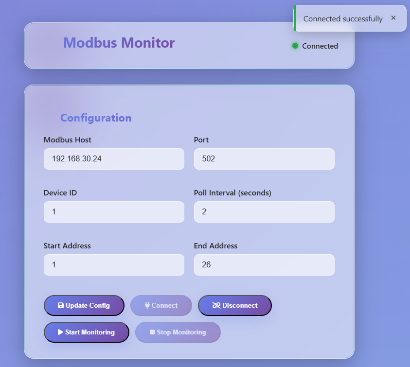
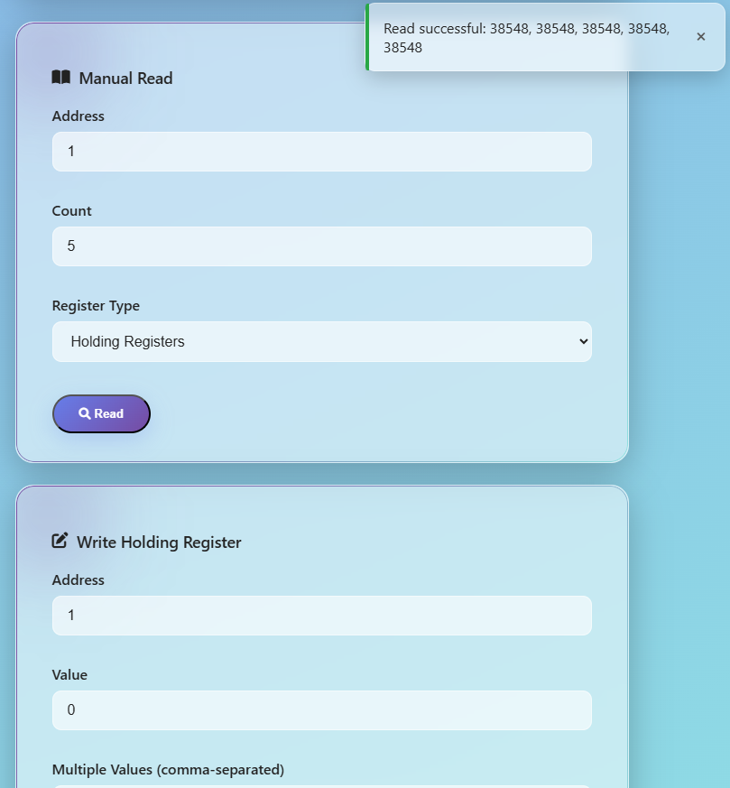
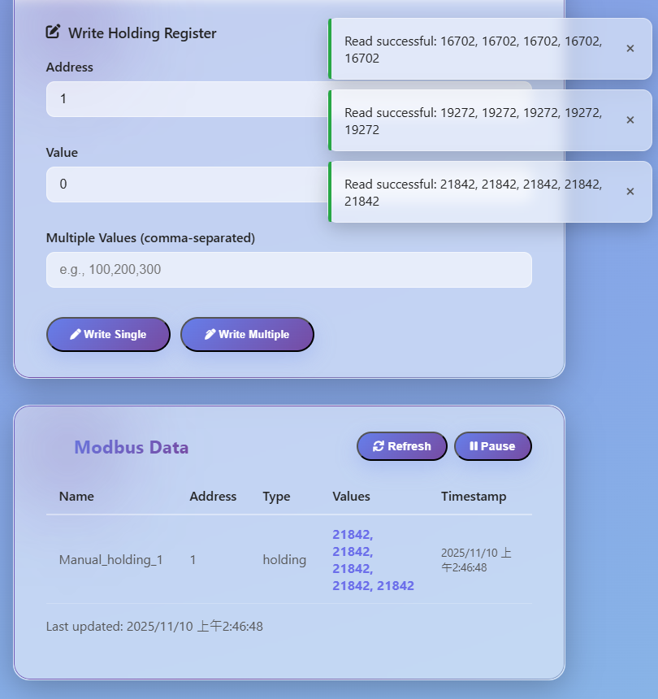

# Async Modbus Monitor

An asynchronous Modbus data monitoring system based on Python asyncio, providing a CLI tool, a FastAPI backend service, and modern Vue 3 frontend interfaces, with full support for Modbus TCP read/write operations.

## 📋 Project Overview

This project is a comprehensive full-stack Modbus monitoring solution, including:

- **Core Python Module**: Asynchronous Modbus client library (`async_modbus_monitor.py`) with advanced features
- **FastAPI Backend**: REST API server with Redis integration for time-series data persistence
- **Dual Frontend Options**: 
  - Legacy frontend: Simple single-page application (`frontend/`)
  - Modern frontend: Vue 3 + Vite application (`frontend-vite/`) with component architecture
- **Data Storage**: Redis for real-time data caching and historical data
- **Containerized Deployment**: One-click deployment with Docker Compose
- **Multi-Interface Support**: Seamlessly switch between CLI, API, and Web interfaces

## 🖼️ System Screenshots

### 1. Web Frontend - Configuration and Connection Control Interface

*A modern Vue 3 interface with configuration panel (Host, Port, Device ID, Poll Interval) and connection control buttons (Update Config, Connect, Disconnect, Start/Stop Monitoring).*

### 2. Web Frontend - Manual Read Interface

*The Manual Read section allows specifying register address, count, and register type (Holding/Input/Coils/Discrete Inputs). Write operations for Holding Registers with immediate feedback.*

### 3. Web Frontend - Write Test and Data Monitoring Interface

*Demonstrates complete write and monitoring workflow. Write to Holding Registers (single/multiple) with real-time Modbus data table showing register name, address, type, values, and timestamp.*

### 4. API Documentation Interface
Visit `http://localhost:8000/docs` to see the complete Swagger UI interactive API documentation, allowing developers to quickly test all endpoints (connection, read, write, monitoring, data query, etc.).

## 📁 Project Structure Analysis

### Core File Overview

```
modbus_monitor/
├── async_modbus_monitor.py      (377 lines) - Core asynchronous Modbus client library
├── start_backend.py             (28 lines)  - Backend service startup script
├── start_dev.sh                (Development environment setup)
├── backend/
│   ├── main.py                  (332 lines) - FastAPI REST API application
│   ├── config.py                (265 lines) - Pydantic-based configuration management
│   ├── modbus_service.py        (297 lines) - Modbus service with Redis integration
│   └── requirements.txt         - Python backend dependencies
├── frontend/                    (Legacy frontend)
│   ├── index.html               (518 lines) - Vue 3 single-page application
│   ├── app.js                  - Frontend application logic
│   └── css/styles.css           - Glass-morphism UI styling
├── frontend-vite/               (Modern Vue 3 + Vite frontend)
│   ├── src/
│   │   ├── App.vue              - Root Vue component
│   │   ├── main.js              - Application entry point
│   │   ├── components/
│   │   │   ├── AlertContainer.vue
│   │   │   ├── Configuration.vue
│   │   │   ├── DataDisplay.vue
│   │   │   ├── ManualRead.vue
│   │   │   └── WriteRegister.vue
│   │   ├── composables/
│   │   │   └── useAlerts.js
│   │   ├── services/
│   │   │   └── api.js            - Axios API client
│   │   └── assets/
│   │       ├── styles.css
│   │       └── page-styles.css
│   ├── index.html                - HTML entry point
│   ├── vite.config.js            - Vite configuration
│   ├── package.json              - Node.js dependencies
│   └── Dockerfile               - Frontend container image
├── docs/
│   ├── CLAUDE.md                - Development guidelines
│   ├── configuration.md          - Detailed configuration guide
│   ├── USAGE.md                 - Usage instructions
│   ├── UML.md                   - System architecture diagrams
│   └── REFACTOR_SUMMARY.md      - Project refactoring documentation
├── docker-compose.yml           - Three-container orchestration
├── Dockerfile.backend           - Backend container image
├── pyproject.toml               - UV project configuration
├── requirements.txt             - Python dependencies
├── .env.example                 - Environment variable template
├── config.conf.example           - Alternative config file template
└── README.md                    - This file
```

### File Function Descriptions

#### Core Modules
- **async_modbus_monitor.py**: Standalone asynchronous Modbus client library with comprehensive read/write operations, connection management, and monitoring capabilities. Can be used independently or as a base for other applications.

#### Backend Services
- **backend/main.py**: FastAPI application providing RESTful API endpoints for Modbus operations, configuration management, and data retrieval.
- **backend/config.py**: Pydantic-based configuration management using pydantic-settings, supporting environment variables and validation.
- **backend/modbus_service.py**: Extended Modbus service integrating Redis for data storage and real-time updates.
- **start_backend.py**: Backend service startup script using uvicorn.

#### Frontend Applications

**Legacy Frontend (`frontend/`)**:
- **frontend/index.html**: Vue 3 single-page application with glass-morphism design.
- **frontend/app.js**: Vue application logic handling API communication.
- **frontend/css/styles.css**: Responsive CSS with modern gradient effects.

**Modern Frontend (`frontend-vite/`)**:
- **frontend-vite/src/App.vue**: Root Vue component with alert system and routing.
- **frontend-vite/src/main.js**: Application entry point with Vue 3 and Element Plus.
- **frontend-vite/src/components/**: Modular Vue components for different features.
- **frontend-vite/src/composables/useAlerts.js**: Composable for alert/toast notifications.
- **frontend-vite/src/services/api.js**: Axios-based API client with interceptors.
- **frontend-vite/vite.config.js**: Vite build configuration.

#### Configuration & Deployment
- **pyproject.toml**: UV project configuration defining dependencies.
- **docker-compose.yml**: Three-container architecture (Redis + Backend + Frontend).
- **Dockerfile.backend**: FastAPI service container definition.
- **.env.example**: Environment variable configuration template.
- **config.conf.example**: Alternative INI-based configuration template.

## 🏗️ System Architecture

### Three-Tier Architecture Design

```
┌─────────────────────────────────────────────────────────┐
│                  Web Frontend (Vue 3)                    │
│         Modern Component-Based UI (Vite/Legacy)        │
└────────────────────┬────────────────────────────────────┘
                     │ HTTP/REST API
┌────────────────────▼────────────────────────────────────┐
│              FastAPI Backend Service                     │
│          (Async HTTP Server + Redis Integration)         │
│  - Config Management (Pydantic Settings)               │
│  - Request Validation (Pydantic Models)                 │
└────────────────────┬────────────────────────────────────┘
                     │
        ┌────────────┼────────────┐
        │                         │
┌───────▼────────┐     ┌─────────▼──────────┐
│  Modbus Service│     │   Redis Database    │
│  (Async TCP)    │     │  (Time-Series Data) │
│  - Connection    │     │  - Latest Data      │
│  - Read/Write    │     │  - History (1000)   │
└───────┬────────┘     └────────────────────┘
        │
┌───────▼────────────────────────┐
│    Modbus TCP Devices           │
│  (PLC, Sensors, Controllers)  │
└────────────────────────────────┘
```

### Key Architecture Features

1. **Asynchronous Design**: Built on Python asyncio for high performance and concurrency
2. **Configuration Management**: Pydantic-based settings with validation and environment variable support
3. **Data Persistence**: Redis integration for caching, latest data, and historical data (sorted set)
4. **Modular Components**: Each component can be developed and deployed independently
5. **Dual Frontend Options**: Both legacy and modern Vue 3 + Vite implementations
6. **Scalability**: Container-based architecture supports horizontal scaling

## 🎯 Technical Features Analysis

### Asynchronous Architecture
- **Event Loop**: Built on Python `asyncio` for high concurrency
- **Non-blocking I/O**: All network operations use `async/await` pattern
- **Concurrency**: Multiple registers read simultaneously using `asyncio.gather()`
- **Performance Advantage**: Single thread handles hundreds of concurrent connections
- **Automatic Reconnection**: Built-in retry logic with configurable limits (max 5 consecutive errors)

### Configuration Management (Pydantic Settings)

#### Configuration Sources Priority (`backend/config.py`)
```python
1. Environment Variables (.env file) - Highest priority
2. Default values in Pydantic models
3. Fallback values in validators
```

#### Supported Configuration Sections

| Section | Class | Description |
|----------|--------|-------------|
| Modbus | `ModbusConfig` | Connection parameters, polling, retry settings |
| Redis | `RedisConfig` | Redis server connection details |
| API | `APIConfig` | FastAPI server configuration |
| Logging | `LoggingConfig` | Log level and format settings |
| Register Ranges | `RegisterRangeConfig` | Flexible register monitoring configuration |

### Comprehensive Write Operations

The system provides robust write operations for Modbus holding registers:

| Operation | Function | Purpose |
|---|---|---|
| Single Write | `write_holding_register()` | Write single value (Function Code 06) |
| Multiple Write | `write_holding_registers()` | Write multiple consecutive values (Function Code 16) |
| Write Verification | Read-back after write | Verify written values |
| Hex/Decimal Support | Value parsing | Support both hex (0x prefix) and decimal |
| Error Handling | Exception management | Graceful error handling with logging |

### Error Handling and Fault Tolerance

#### Connection Level (`async_modbus_monitor.py:236-286`)
```python
consecutive_errors = 0
max_consecutive_errors = 5

while self.running:
    if not self.client.connected:
        if not await self.connect():
            consecutive_errors += 1
            if consecutive_errors >= max_consecutive_errors:
                break  # Stop if limit exceeded
```

#### Read Level
- Catches `ModbusException` and generic `Exception`
- Detailed error logging
- Returns `None` instead of raising exceptions for graceful degradation

## 🚀 Features

### 1. Complete Modbus Operations

#### Supported Register Types

| Type | Modbus Function Code | Read | Write | Data Type | Typical Use |
|---|---|---|---|---|
| Holding Registers | FC03, FC06, FC16 | ✅ | ✅ | 16-bit | Setpoints, parameters |
| Input Registers | FC04 | ✅ | ❌ | 16-bit | Sensor readings |
| Coils | FC01, FC05, FC15 | ✅ | ✅ | 1-bit | Digital output control |
| Discrete Inputs | FC02 | ✅ | ❌ | 1-bit | Switch status, alarms |

**Note**: Write operations are fully implemented for Holding Registers (FC06, FC16). Coil write operations (FC05, FC15) are supported in backend service.

### 2. Three Usage Modes

#### A. CLI Mode

**Basic Usage** (`async_modbus_monitor.py`):

```bash
# Run the CLI tool with default configuration
uv run python async_modbus_monitor.py

# Or with uvicorn for backend mode
uv run python start_backend.py
```

The CLI tool demonstrates:
- Direct read_register() calls
- Continuous monitoring with monitor_continuously()
- Custom data handlers
- Write operations (single and multiple)

#### B. REST API Mode

**Start backend service**:
```bash
# Method 1: Using start_backend.py
uv run python start_backend.py

# Method 2: Direct uvicorn
uv run uvicorn backend.main:app --host 0.0.0.0 --port 8000 --reload
```

**API Endpoint List** (`backend/main.py`):

| Endpoint | Method | Function | Request Body |
|---|---|---|---|
| `/api/config` | GET | Get configuration | - |
| `/api/config` | POST | Update configuration | ModbusConfigModel |
| `/api/connect` | POST | Connect to device | - |
| `/api/disconnect` | POST | Disconnect from device | - |
| `/api/status` | GET | Get connection status | - |
| `/api/read` | POST | Read registers | RegisterReadRequest |
| `/api/write` | POST | Write single register | RegisterWriteRequest |
| `/api/write_multiple` | POST | Write multiple registers | MultipleRegisterWriteRequest |
| `/api/start_monitoring` | POST | Start continuous monitoring | - |
| `/api/stop_monitoring` | POST | Stop monitoring | - |
| `/api/data/latest` | GET | Get latest data | - |
| `/api/data/history` | GET | Get historical data | `limit` (query param) |

**API Usage Example**:
```bash
# Connect to device
curl -X POST http://localhost:8000/api/connect

# Read registers
curl -X POST http://localhost:8000/api/read \
  -H "Content-Type: application/json" \
  -d '{"address": 0, "count": 10, "register_type": "holding"}'

# Write a register
curl -X POST http://localhost:8000/api/write \
  -H "Content-Type: application/json" \
  -d '{"address": 10, "value": 1234}'

# Write multiple registers
curl -X POST http://localhost:8000/api/write_multiple \
  -H "Content-Type: application/json" \
  -d '{"address": 10, "values": [100, 200, 300]}'

# Get latest data
curl http://localhost:8000/api/data/latest

# Get historical data (last 50 entries)
curl "http://localhost:8000/api/data/history?limit=50"
```

#### C. Web Interface Mode

**Modern Frontend (Vue 3 + Vite)**:
```bash
# Development mode
cd frontend-vite
npm install
npm run dev
# Access at: http://localhost:5173

# Production build
npm run build
# Serves dist/ folder
```

**Modern Frontend Features**:
1. **Configuration Panel**: Dynamic Modbus connection parameters
2. **Connection Control**: Connect/Disconnect/Start Monitoring/Stop buttons
3. **Manual Read**: Specify address, count, and register type
4. **Write Operations**: Single and multiple register writes with immediate feedback
5. **Data Display**: Real-time data in table format with timestamps
6. **Alert System**: Toast notifications for operation results
7. **Auto-Refresh**: Toggle automatic data updates
8. **Status Indicators**: Visual connection and monitoring status

**Legacy Frontend**:
```bash
# Access at: http://localhost:8081
# Simple single-page application with glass-morphism design
```

### 3. Flexible Configuration Management

#### Environment Variables (`.env.example`)
```bash
# Modbus device network configuration
MODBUS_HOST=192.168.30.24
MODBUS_PORT=502
MODBUS_DEVICE_ID=1

# Polling and timeout settings
MODBUS_POLL_INTERVAL=2.0
MODBUS_TIMEOUT=3.0
MODBUS_RETRIES=3

# Register range configuration
START_ADDRESS=1
END_ADDRESS=26

# Redis configuration
REDIS_HOST=localhost
REDIS_PORT=6379
REDIS_PASSWORD=
REDIS_DB=0

# API configuration
API_HOST=0.0.0.0
API_PORT=8000
API_DEBUG=False
API_CORS_ORIGINS=*

# Logging configuration
LOG_LEVEL=INFO
```

#### Configuration File Alternative (`config.conf.example`)
```ini
[modbus]
host = 192.168.30.24
port = 502
device_id = 1

[polling]
poll_interval = 2.0
timeout = 3.0
retries = 3

[registers]
start_address = 1
end_address = 26
```

## 📦 Dependency Analysis

### Python Dependencies (`requirements.txt`, `pyproject.toml`)

#### Core Dependencies
```toml
[project.dependencies]
pymodbus = ">=3.0.0"        # Modbus protocol implementation
python-dotenv = ">=1.0.0"   # Environment variable management
```

#### Backend Dependencies
```toml
fastapi = ">=0.104.0"             # Web framework
uvicorn[standard] = ">=0.24.0"    # ASGI server
redis = ">=5.0.0"                 # Redis client
pydantic = ">=2.0.0"              # Data validation
pydantic-settings = ">=2.0.0"      # Configuration management
python-multipart = ">=0.0.6"      # Form handling
```

### Frontend Dependencies (`frontend-vite/package.json`)

#### Modern Frontend
```json
{
  "dependencies": {
    "vue": "^3.5.24",           // Vue 3 framework
    "axios": "^1.13.2"           // HTTP client
  },
  "devDependencies": {
    "@vitejs/plugin-vue": "^6.0.1", // Vite Vue plugin
    "vite": "^7.2.4"              // Build tool
  }
}
```

### System Dependencies

- **Python**: >= 3.10 (uses modern type hints and async features)
- **Redis**: >= 7.0 (for time-series data storage)
- **Node.js**: >= 18 (for frontend-vite development)
- **UV**: Python package manager (recommended, 10-100x faster than pip)
- **Docker**: >= 20.10 (optional, for containerized deployment)

## 🔧 Installation and Setup

### Prerequisites

- **Python**: >= 3.10
- **Redis**: >= 7.0
- **Node.js**: >= 18 (for frontend-vite development)
- **UV**: Python package manager (recommended)
- **Docker**: >= 20.10 (optional)

### Method 1: Using UV (Recommended)

```bash
# 1. Install UV
curl -LsSf https://astral.sh/uv/install.sh | sh

# 2. Clone project
git clone https://github.com/sprigga/modbus_monitor.git
cd modbus_monitor

# 3. Sync dependencies
uv sync

# 4. Configure environment
cp .env.example .env
nano .env  # Edit MODBUS_HOST, etc.

# 5. Start Redis (if needed)
docker run -d -p 6379:6379 --name modbus-redis redis:7-alpine

# 6. Run backend
uv run python start_backend.py

# 7. Run frontend (modern - Vite)
cd frontend-vite
npm install
npm run dev
# Access at http://localhost:5173
```

### Method 2: Using Docker Compose

```bash
# 1. Configure environment
cp .env.example .env
nano .env

# 2. Start all services
docker-compose up -d

# 3. Check status
docker-compose ps

# 4. View logs
docker-compose logs -f backend

# 5. Access services
# - Modern Frontend: http://localhost:5173
# - Legacy Frontend: http://localhost:8081
# - API Docs: http://localhost:8000/docs

# 6. Stop services
docker-compose down
```

### Method 3: Traditional Pip Installation

```bash
# 1. Create virtual environment
python3 -m venv venv
source venv/bin/activate

# 2. Install dependencies
pip install -r requirements.txt

# 3. Configure environment
cp .env.example .env

# 4. Run backend
python start_backend.py

# 5. Run frontend (legacy)
# Serve frontend/ folder with any web server
```

## 💡 Usage Examples

### Example 1: Basic Read Monitoring

```python
from async_modbus_monitor import AsyncModbusMonitor, ModbusConfig
import asyncio
import logging

async def main():
    logging.basicConfig(level=logging.INFO)

    config = ModbusConfig(
        host='192.168.1.100',
        port=502,
        device_id=1,
        poll_interval=2.0
    )

    monitor = AsyncModbusMonitor(config)

    # Add registers to monitor
    monitor.add_register(address=0, count=10, register_type='holding', name='Temperature')

    if await monitor.connect():
        print("✅ Connected!")
        await monitor.monitor_continuously()

if __name__ == "__main__":
    asyncio.run(main())
```

### Example 2: Writing Registers

```python
from async_modbus_monitor import AsyncModbusMonitor, ModbusConfig
import asyncio

async def write_example():
    config = ModbusConfig(host='192.168.1.100')
    monitor = AsyncModbusMonitor(config)

    if await monitor.connect():
        # Single write
        success = await monitor.write_holding_register(address=10, value=1234)
        print(f"Write: {'Success' if success else 'Failed'}")

        # Multiple write
        success = await monitor.write_holding_registers(
            address=20,
            values=[100, 200, 300]
        )
        print(f"Multi-write: {'Success' if success else 'Failed'}")

    await monitor.disconnect()

asyncio.run(write_example())
```

### Example 3: Custom Data Processing

```python
from async_modbus_monitor import AsyncModbusMonitor, ModbusConfig
from typing import List, Dict, Any
import asyncio

async def custom_processor(data: List[Dict[str, Any]]):
    """Custom data handler"""
    for item in data:
        values = item['values']
        avg = sum(values) / len(values)
        print(f"{item['name']}: avg={avg:.2f}, max={max(values)}")

async def main():
    config = ModbusConfig(host='192.168.1.100', poll_interval=5.0)
    monitor = AsyncModbusMonitor(config)
    monitor.add_register(0, 8, 'holding', 'Sensors')

    if await monitor.connect():
        await monitor.monitor_continuously(data_callback=custom_processor)

asyncio.run(main())
```

## 📚 API Documentation

### REST API Reference

FastAPI automatically generates interactive documentation:
- **Swagger UI**: http://localhost:8000/docs
- **ReDoc**: http://localhost:8000/redoc
- **OpenAPI JSON**: http://localhost:8000/openapi.json

### Key API Endpoints

#### 1. Configuration
```http
GET /api/config
POST /api/config
```

#### 2. Connection Control
```http
POST /api/connect
POST /api/disconnect
GET /api/status
```

#### 3. Data Operations
```http
POST /api/read
POST /api/write
POST /api/write_multiple
```

#### 4. Monitoring Control
```http
POST /api/start_monitoring
POST /api/stop_monitoring
```

#### 5. Data Retrieval
```http
GET /api/data/latest
GET /api/data/history?limit=100
```

## 🔐 Security Considerations

### Production Deployment Checklist

- [ ] Use a firewall to restrict access to Modbus port (502)
- [ ] Isolate Modbus devices on a dedicated VLAN
- [ ] Use VPN for remote access
- [ ] Configure CORS origins appropriately
- [ ] Implement authentication (JWT, OAuth2)
- [ ] Add rate limiting
- [ ] Enable HTTPS with SSL/TLS
- [ ] Implement audit logging
- [ ] Use secret management for sensitive data
- [ ] Disable debug mode in production

### Example Security Configuration

```python
# backend/main.py - Configure CORS for production
app.add_middleware(
    CORSMiddleware,
    allow_origins=["https://your-domain.com"],  # Restrict to your domain
    allow_credentials=True,
    allow_methods=["GET", "POST"],
    allow_headers=["Authorization", "Content-Type"],
)
```

## 📝 Development Guidelines

### Code Style Standards

- Use UV for Python environment management
- Follow PEP 8 standards
- Add type hints to all functions
- Write comprehensive docstrings
- Preserve original code with comments when modifying
- Test all changes before committing

### Configuration Best Practices

1. Use `.env` file for environment-specific settings
2. Never commit `.env` files to version control
3. Use `pydantic-settings` for type-safe configuration
4. Validate all user inputs
5. Provide sensible defaults

## 🔧 Troubleshooting

### Common Issues

#### Connection Failed
```bash
# Test connectivity
ping <modbus-ip>
nc -zv <modbus-ip> 502

# Check firewall
sudo iptables -L -n | grep 502
```

### Testing with Modbus Simulator

For testing without actual hardware, you can use the [IBM Maximo Modbus Simulator](https://ibm.github.io/maximo-labs/monitor_modbus_simulator/):

- **Link**: https://ibm.github.io/maximo-labs/monitor_modbus_simulator/
- **Purpose**: A web-based Modbus TCP simulator for testing and development
- **Usage**: Configure your monitor to connect to the simulator's IP and port (typically 502)
- **Features**: Simulates various register types, supports read/write operations

This simulator is especially useful for:
- Initial setup and testing of the monitoring system
- Development and debugging without physical Modbus devices
- Training and demonstrations

#### Redis Connection Issues
```bash
# Check Redis status
redis-cli ping

# Start Redis
docker run -d -p 6379:6379 redis:7-alpine
```

#### Frontend Build Issues
```bash
# Clear node modules and reinstall
cd frontend-vite
rm -rf node_modules package-lock.json
npm install
```

## 🤝 Contribution Guide

### Submission Process

1. Fork the project
2. Create a feature branch
3. Make changes following development guidelines
4. Run tests
5. Submit a pull request with conventional commit message

### Commit Message Convention

Use [Conventional Commits](https://www.conventionalcommits.org/):
- `feat`: New feature
- `fix`: Bug fix
- `docs`: Documentation update
- `style`: Code style adjustments
- `refactor`: Refactoring
- `test`: Test-related
- `chore`: Build/tool-related

## 📄 License

This project is licensed under the MIT License. See LICENSE file for details.

## 📞 Contact

- **Issue Tracker**: [GitHub Issues](https://github.com/sprigga/modbus_monitor/issues)
- **Discussions**: [GitHub Discussions](https://github.com/sprigga/modbus_monitor/discussions)

## 🙏 Acknowledgements

### Open Source Projects
- [pymodbus](https://github.com/pymodbus-dev/pymodbus) - Modbus protocol implementation
- [FastAPI](https://github.com/tiangolo/fastapi) - Modern Python web framework
- [Vue.js](https://github.com/vuejs/core) - Progressive JavaScript framework
- [Redis](https://github.com/redis/redis) - High-performance in-memory database
- [UV](https://github.com/astral-sh/uv) - Fast Python package manager
- [Vite](https://github.com/vitejs/vite) - Next-generation frontend tool

---

**Last Updated**: 2025-12-30  
**Project Version**: 1.0.0  
**Python Version**: >= 3.10  
**Maintenance Status**: 🟢 Active Development
