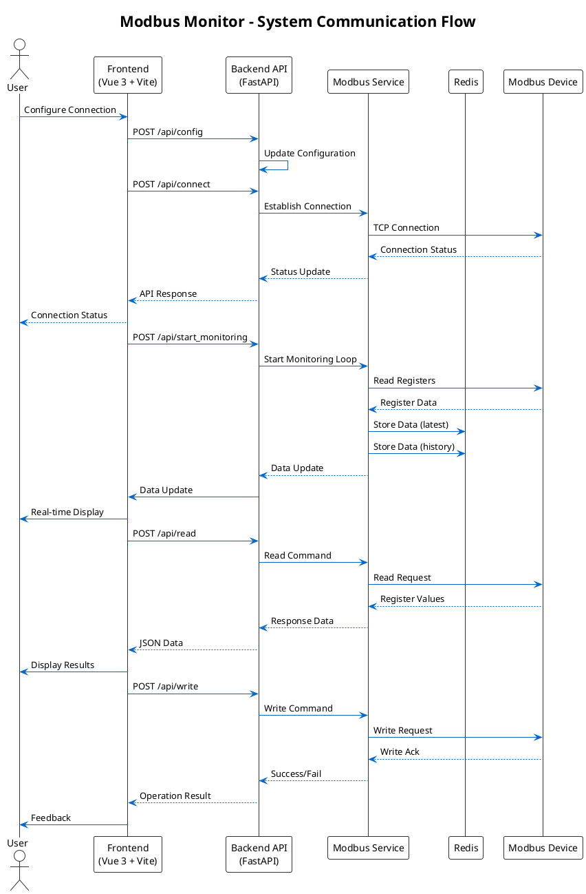
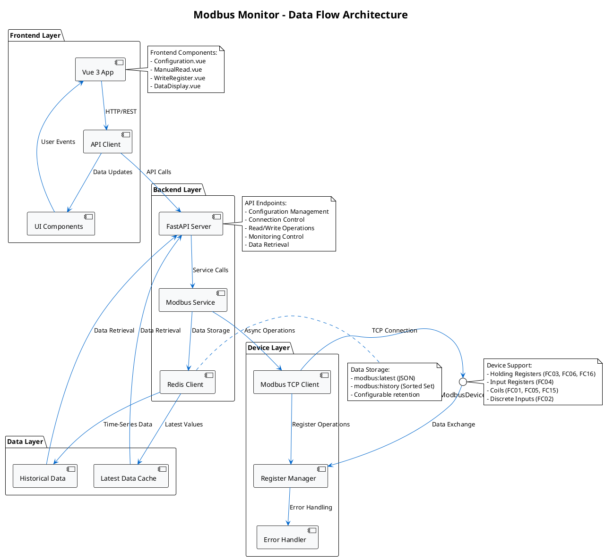
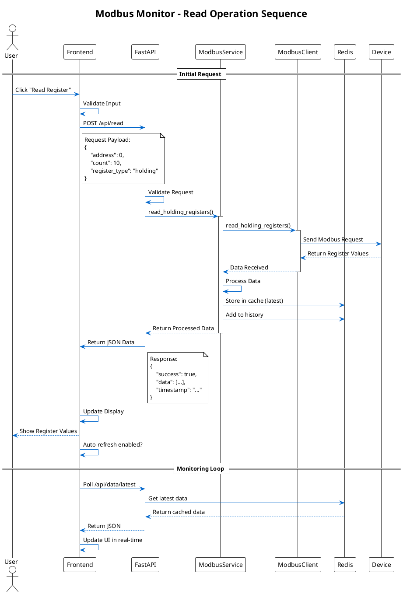
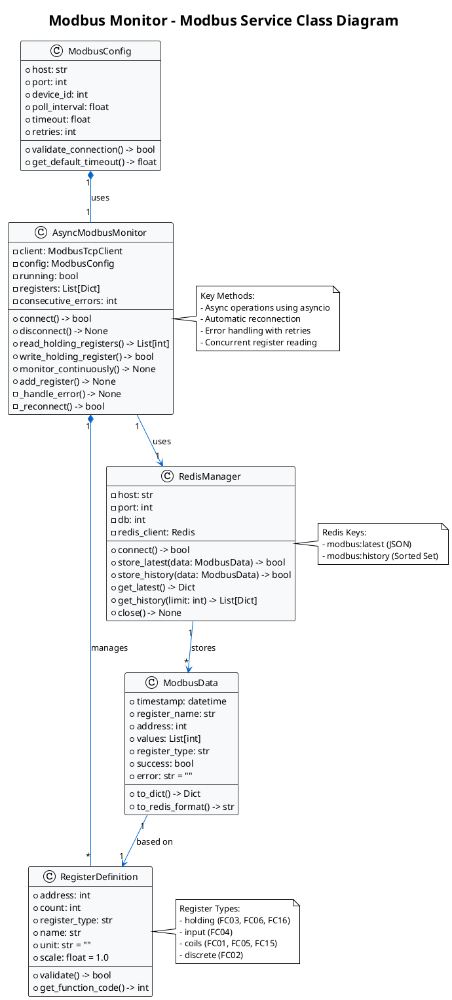
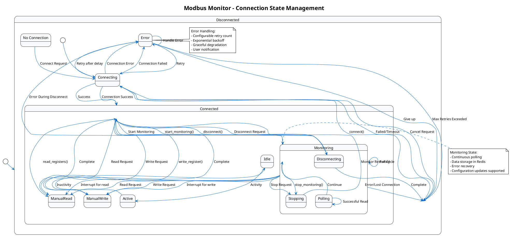

# Modbus Monitor

A comprehensive full-stack asynchronous Modbus data monitoring system built with Python asyncio, FastAPI, Vue 3, and Redis. Provides CLI tools, REST API services, and modern web interfaces with complete support for Modbus TCP read/write operations.

## 📋 Project Overview

This project is a comprehensive full-stack Modbus monitoring solution featuring:

- **Core Python Module**: Asynchronous Modbus client library (`scripts/async_modbus_monitor.py`) with advanced features
- **FastAPI Backend**: REST API server with Redis integration for real-time data persistence and time-series storage
- **Modern Vue 3 Frontend**: Component-based web interface with Vite build system (`frontend-vite/`)
- **Legacy Frontend**: Simple single-page application (`frontend/`) for compatibility
- **Redis Integration**: Real-time data caching, latest values, and historical data storage
- **Docker Deployment**: Multi-container orchestration with custom port configuration
- **Multiple Interfaces**: CLI, REST API, and modern web interface options

## 🚀 Quick Start

### Using Docker Compose (Recommended)

```bash
# 1. Clone and configure
git clone <repository-url>
cd modbus_monitor
cp .env.example .env
# Edit .env with your Modbus device settings

# 2. Start all services
docker-compose up -d --build

# 3. Access applications
# - Web Interface: http://localhost:18081
# - API Documentation: http://localhost:18000/docs
# - Redis: localhost:16380
```

### Using UV (Development)

```bash
# 1. Install dependencies
uv sync

# 2. Start Redis
docker run -d -p 6379:6379 redis:7-alpine

# 3. Start backend
uv run python scripts/start_backend.py

# 4. Start frontend (in new terminal)
cd frontend-vite && npm install && npm run dev
```

## 🖼️ System Screenshots

### 1. Web Frontend - Configuration and Connection Control Interface

*A modern Vue 3 interface with configuration panel (Host, Port, Device ID, Poll Interval) and connection control buttons (Update Config, Connect, Disconnect, Start/Stop Monitoring).*

### 2. Web Frontend - Manual Read Interface

*The Manual Read section allows specifying register address, count, and register type (Holding/Input/Coils/Discrete Inputs). Write operations for Holding Registers with immediate feedback.*

### 3. Web Frontend - Write Test and Data Monitoring Interface

*Demonstrates complete write and monitoring workflow. Write to Holding Registers (single/multiple) with real-time Modbus data table showing register name, address, type, values, and timestamp.*

### 4. API Documentation Interface
Visit `http://localhost:8000/docs` to see the complete Swagger UI interactive API documentation, allowing developers to quickly test all endpoints (connection, read, write, monitoring, data query, etc.).

## 📁 Project Structure Analysis

### Core File Overview

```
modbus_monitor/
├── pyproject.toml               - UV project configuration and dependencies
├── docker-compose.yml           - Multi-container orchestration (Redis, Backend, Frontend)
├── requirements.txt             - Python dependencies
├── .env.example                 - Environment variables template
├── config.conf.example          - Alternative INI configuration template
├── scripts/
│   ├── async_modbus_monitor.py  (377 lines) - Core asynchronous Modbus client library
│   ├── start_backend.py         (28 lines)  - Backend service startup script
│   └── start_dev.sh            - Development environment setup script
├── backend/
│   ├── main.py                  (382 lines) - FastAPI REST API application with CORS
│   ├── config.py                (289 lines) - Pydantic-based configuration management
│   ├── modbus_service.py        (297 lines) - Modbus service with Redis integration
│   ├── Dockerfile               - Backend container configuration
│   └── requirements.txt         - Python backend dependencies
├── frontend/                    (Legacy frontend)
│   ├── index.html               (518 lines) - Vue 3 single-page application
│   ├── app.js                  - Frontend application logic
│   └── css/styles.css           - Glass-morphism UI styling
├── frontend-vite/               (Modern Vue 3 + Vite frontend)
│   ├── src/
│   │   ├── App.vue              - Root Vue component
│   │   ├── main.js              - Application entry point
│   │   ├── components/
│   │   │   ├── AlertContainer.vue
│   │   │   ├── Configuration.vue
│   │   │   ├── DataDisplay.vue
│   │   │   ├── ManualRead.vue
│   │   │   └── WriteRegister.vue
│   │   ├── composables/
│   │   │   └── useAlerts.js
│   │   ├── services/
│   │   │   └── api.js            - Axios API client
│   │   └── assets/
│   │       ├── styles.css
│   │       └── page-styles.css
│   ├── index.html                - HTML entry point
│   ├── vite.config.js            - Vite configuration
│   ├── package.json              - Node.js dependencies
│   └── Dockerfile               - Frontend container image
├── docs/
│   ├── CLAUDE.md                - Development guidelines
│   ├── configuration.md          - Detailed configuration guide
│   ├── USAGE.md                 - Usage instructions
│   ├── UML.md                   - System architecture diagrams
│   └── REFACTOR_SUMMARY.md      - Project refactoring documentation
├── docker-compose.yml           - Three-container orchestration
├── Dockerfile.backend           - Backend container image
├── pyproject.toml               - UV project configuration
├── requirements.txt             - Python dependencies
├── .env.example                 - Environment variable template
├── config.conf.example           - Alternative config file template
└── README.md                    - This file
```

### File Function Descriptions

#### Core Modules
- **scripts/async_modbus_monitor.py**: Standalone asynchronous Modbus client library with comprehensive read/write operations, connection management, monitoring capabilities, and error handling. Can be used independently or as a foundation for other applications.

#### Backend Services
- **backend/main.py**: FastAPI application providing RESTful API endpoints for Modbus operations, configuration management, data retrieval, and background monitoring tasks with CORS middleware.
- **backend/config.py**: Pydantic-based configuration management using pydantic-settings, supporting environment variables, validation, and multiple configuration sources.
- **backend/modbus_service.py**: Extended Modbus service integrating Redis for real-time data storage, historical data management, and time-series operations.
- **scripts/start_backend.py**: Backend service startup script using uvicorn with configurable host and port settings.

#### Frontend Applications

**Legacy Frontend (`frontend/`)**:
- **frontend/index.html**: Vue 3 single-page application with glass-morphism design.
- **frontend/app.js**: Vue application logic handling API communication.
- **frontend/css/styles.css**: Responsive CSS with modern gradient effects.

**Modern Frontend (`frontend-vite/`)**:
- **frontend-vite/src/App.vue**: Root Vue component with alert system and routing.
- **frontend-vite/src/main.js**: Application entry point with Vue 3 and Element Plus.
- **frontend-vite/src/components/**: Modular Vue components for different features.
- **frontend-vite/src/composables/useAlerts.js**: Composable for alert/toast notifications.
- **frontend-vite/src/services/api.js**: Axios-based API client with interceptors.
- **frontend-vite/vite.config.js**: Vite build configuration.

#### Configuration & Deployment
- **pyproject.toml**: UV project configuration defining dependencies, build system, and project metadata with modern Python packaging standards.
- **docker-compose.yml**: Multi-container orchestration (Redis, FastAPI Backend, Vue Frontend) with custom port mapping and volume management.
- **backend/Dockerfile**: FastAPI service container definition with Python 3.11 base image and optimized build process.
- **frontend-vite/Dockerfile**: Vue 3 frontend container with Nginx serving built static files.
- **.env.example**: Comprehensive environment variable configuration template covering Modbus, Redis, API, and logging settings.
- **config.conf.example**: Alternative INI-based configuration template for file-based configuration.

## 🏗️ System Architecture

### Three-Tier Architecture Design

```
┌─────────────────────────────────────────────────────────┐
│                  Web Frontend (Vue 3)                    │
│         Modern Component-Based UI (Vite/Legacy)        │
└────────────────────┬────────────────────────────────────┘
                     │ HTTP/REST API
┌────────────────────▼────────────────────────────────────┐
│              FastAPI Backend Service                     │
│          (Async HTTP Server + Redis Integration)         │
│  - Config Management (Pydantic Settings)               │
│  - Request Validation (Pydantic Models)                 │
└────────────────────┬────────────────────────────────────┘
                     │
        ┌────────────┼────────────┐
        │                         │
┌───────▼────────┐     ┌─────────▼──────────┐
│  Modbus Service│     │   Redis Database    │
│  (Async TCP)    │     │  (Time-Series Data) │
│  - Connection    │     │  - Latest Data      │
│  - Read/Write    │     │  - History (1000)   │
└───────┬────────┘     └────────────────────┘
        │
┌───────▼────────────────────────┐
│    Modbus TCP Devices           │
│  (PLC, Sensors, Controllers)  │
└────────────────────────────────┘
```

### Key Architecture Features

1. **Asynchronous Design**: Built on Python asyncio for high performance and concurrency
2. **Configuration Management**: Pydantic-based settings with validation and environment variable support
3. **Data Persistence**: Redis integration for real-time caching, latest data, and historical time-series data (sorted sets)
4. **Modular Components**: Each component can be developed, deployed, and scaled independently
5. **Modern Frontend**: Vue 3 with Vite build system, component architecture, and Axios API client
6. **Container Architecture**: Docker Compose orchestration with custom port mapping for production deployment
7. **Development Flexibility**: Support for both containerized and direct development workflows

## 🎯 Technical Features Analysis

### Asynchronous Architecture
- **Event Loop**: Built on Python `asyncio` for high concurrency
- **Non-blocking I/O**: All network operations use `async/await` pattern
- **Concurrency**: Multiple registers read simultaneously using `asyncio.gather()`
- **Performance Advantage**: Single thread handles hundreds of concurrent connections
- **Automatic Reconnection**: Built-in retry logic with configurable limits (max 5 consecutive errors)

### Configuration Management (Pydantic Settings)

#### Configuration Sources Priority (`backend/config.py`)
```python
1. Environment Variables (.env file) - Highest priority
2. Default values in Pydantic models
3. Fallback values in validators
```

#### Supported Configuration Sections

| Section | Class | Description |
|----------|--------|-------------|
| Modbus | `ModbusConfig` | Connection parameters, polling, retry settings |
| Redis | `RedisConfig` | Redis server connection details |
| API | `APIConfig` | FastAPI server configuration |
| Logging | `LoggingConfig` | Log level and format settings |
| Register Ranges | `RegisterRangeConfig` | Flexible register monitoring configuration |

### Comprehensive Write Operations

The system provides robust write operations for Modbus holding registers:

| Operation | Function | Purpose |
|---|---|---|
| Single Write | `write_holding_register()` | Write single value (Function Code 06) |
| Multiple Write | `write_holding_registers()` | Write multiple consecutive values (Function Code 16) |
| Write Verification | Read-back after write | Verify written values |
| Hex/Decimal Support | Value parsing | Support both hex (0x prefix) and decimal |
| Error Handling | Exception management | Graceful error handling with logging |

### Error Handling and Fault Tolerance

#### Connection Level (`async_modbus_monitor.py:236-286`)
```python
consecutive_errors = 0
max_consecutive_errors = 5

while self.running:
    if not self.client.connected:
        if not await self.connect():
            consecutive_errors += 1
            if consecutive_errors >= max_consecutive_errors:
                break  # Stop if limit exceeded
```

#### Read Level
- Catches `ModbusException` and generic `Exception`
- Detailed error logging
- Returns `None` instead of raising exceptions for graceful degradation

## 🚀 Features

### 1. Complete Modbus Operations

#### Supported Register Types

| Type | Modbus Function Code | Read | Write | Data Type | Typical Use |
|---|---|---|---|---|
| Holding Registers | FC03, FC06, FC16 | ✅ | ✅ | 16-bit | Setpoints, parameters |
| Input Registers | FC04 | ✅ | ❌ | 16-bit | Sensor readings |
| Coils | FC01, FC05, FC15 | ✅ | ✅ | 1-bit | Digital output control |
| Discrete Inputs | FC02 | ✅ | ❌ | 1-bit | Switch status, alarms |

**Note**: Write operations are fully implemented for Holding Registers (FC06, FC16). Coil write operations (FC05, FC15) are supported in backend service.

### 2. Three Usage Modes

#### A. CLI Mode

**Basic Usage** (`scripts/async_modbus_monitor.py`):

```bash
# Run CLI tool with default configuration
uv run python scripts/async_modbus_monitor.py

# Or with uvicorn for backend mode
uv run python scripts/start_backend.py
```

The CLI tool demonstrates:
- Direct read_register() calls
- Continuous monitoring with monitor_continuously()
- Custom data handlers
- Write operations (single and multiple)

#### B. REST API Mode

**Start backend service**:
```bash
# Method 1: Using scripts/start_backend.py
uv run python scripts/start_backend.py

# Method 2: Direct uvicorn
uv run uvicorn backend.main:app --host 0.0.0.0 --port 8000 --reload
```

**API Endpoint List** (`backend/main.py`):

| Endpoint | Method | Function | Request Body |
|---|---|---|---|
| `/api/config` | GET | Get configuration | - |
| `/api/config` | POST | Update configuration | ModbusConfigModel |
| `/api/connect` | POST | Connect to device | - |
| `/api/disconnect` | POST | Disconnect from device | - |
| `/api/status` | GET | Get connection status | - |
| `/api/read` | POST | Read registers | RegisterReadRequest |
| `/api/write` | POST | Write single register | RegisterWriteRequest |
| `/api/write_multiple` | POST | Write multiple registers | MultipleRegisterWriteRequest |
| `/api/start_monitoring` | POST | Start continuous monitoring | - |
| `/api/stop_monitoring` | POST | Stop monitoring | - |
| `/api/data/latest` | GET | Get latest data | - |
| `/api/data/history` | GET | Get historical data | `limit` (query param) |

**API Usage Example**:
```bash
# Connect to device (Docker deployment)
curl -X POST http://localhost:18000/api/connect

# Connect to device (Direct deployment)
curl -X POST http://localhost:8000/api/connect

# Read registers
curl -X POST http://localhost:18000/api/read \
  -H "Content-Type: application/json" \
  -d '{"address": 0, "count": 10, "register_type": "holding"}'

# Write a register
curl -X POST http://localhost:18000/api/write \
  -H "Content-Type: application/json" \
  -d '{"address": 10, "value": 1234}'

# Write multiple registers
curl -X POST http://localhost:18000/api/write_multiple \
  -H "Content-Type: application/json" \
  -d '{"address": 10, "values": [100, 200, 300]}'

# Get latest data
curl http://localhost:18000/api/data/latest

# Get historical data (last 50 entries)
curl "http://localhost:18000/api/data/history?limit=50"
```

#### C. Web Interface Mode

**Modern Frontend (Vue 3 + Vite)** - Primary Implementation:
```bash
# Development mode
cd frontend-vite
npm install
npm run dev
# Access at: http://localhost:5173

# Production build
npm run build
# Serves dist/ folder via Nginx in Docker

# Docker deployment
docker-compose up frontend -d
# Access at: http://localhost:18081
```

**Modern Frontend Component Architecture**:
1. **Configuration Panel**: Dynamic Modbus connection parameters with validation
2. **Connection Control**: Real-time connection status with Connect/Disconnect/Start/Stop buttons
3. **Manual Read Operations**: Interactive register reading with address, count, and type selection
4. **Write Operations**: Single and multiple register writes with immediate feedback and validation
5. **Data Display**: Real-time data table with timestamps, register names, and auto-refresh capabilities
6. **Alert System**: Toast notifications using composables for user feedback
7. **Status Indicators**: Visual connection, monitoring, and operation status indicators
8. **Responsive Design**: Modern CSS with responsive layouts and glassmorphism effects

**Legacy Frontend** - Compatibility Option:
```bash
# Simple HTTP server for legacy frontend
# Access at: http://localhost:8081 (if served separately)
# Single-page Vue 3 application with basic styling
```

### 3. Flexible Configuration Management

#### Environment Variables (`.env.example`)
```env
# Modbus device network configuration
MODBUS_HOST=192.168.30.24          # Your Modbus device IP
MODBUS_PORT=502                     # Standard Modbus TCP port
MODBUS_DEVICE_ID=1                  # Modbus slave/unit ID

# Polling and timeout settings
MODBUS_POLL_INTERVAL=2.0            # Seconds between polling
MODBUS_TIMEOUT=3.0                  # Connection timeout
MODBUS_RETRIES=3                    # Retry attempts

# Register range configuration
START_ADDRESS=1                     # First register to monitor
END_ADDRESS=26                      # Last register to monitor

# Redis configuration
REDIS_HOST=localhost                # Redis server host
REDIS_PORT=6379                     # Redis server port (16380 in Docker)
REDIS_PASSWORD=                     # Redis password (empty for no auth)
REDIS_DB=0                          # Redis database number

# API configuration
API_HOST=0.0.0.0                    # FastAPI bind address
API_PORT=8000                       # FastAPI port (18000 in Docker)
API_DEBUG=False                     # Enable debug mode
API_CORS_ORIGINS=*                  # CORS allowed origins

# Logging configuration
LOG_LEVEL=INFO                      # Logging level (DEBUG, INFO, WARN, ERROR)
```

#### Configuration File Alternative (`config.conf.example`)
```ini
[modbus]
host = 192.168.30.24
port = 502
device_id = 1

[polling]
poll_interval = 2.0
timeout = 3.0
retries = 3

[registers]
start_address = 1
end_address = 26
```

## 📦 Dependency Analysis

### Python Dependencies (`requirements.txt`, `pyproject.toml`)

#### Project Dependencies (pyproject.toml)
```toml
[project]
name = "modbus-monitor"
version = "0.1.0"
requires-python = ">=3.10"
dependencies = [
    "fastapi>=0.104.0",           # Modern web framework
    "uvicorn[standard]>=0.24.0",  # ASGI server with websocket support
    "python-multipart>=0.0.6",   # Form data handling
    "pymodbus>=3.0.0",           # Modbus protocol implementation
    "redis>=5.0.0",              # Redis async client
    "python-dotenv>=1.0.0",      # Environment variable management
    "pydantic>=2.0.0"            # Data validation and settings
]
```

#### Additional Backend Dependencies
- **pydantic-settings**: Configuration management with environment variable support
- **asyncio**: Built-in Python async/await framework
- **logging**: Comprehensive logging system

### Frontend Dependencies (`frontend-vite/package.json`)

#### Modern Frontend
```json
{
  "dependencies": {
    "vue": "^3.5.24",           // Vue 3 framework
    "axios": "^1.13.2"           // HTTP client
  },
  "devDependencies": {
    "@vitejs/plugin-vue": "^6.0.1", // Vite Vue plugin
    "vite": "^7.2.4"              // Build tool
  }
}
```

### System Dependencies

- **Python**: >= 3.10 (uses modern type hints and async features)
- **Redis**: >= 7.0 (for time-series data storage)
- **Node.js**: >= 18 (for frontend-vite development)
- **UV**: Python package manager (recommended, 10-100x faster than pip)
- **Docker**: >= 20.10 (optional, for containerized deployment)

## 🔧 Installation and Setup

### Prerequisites

- **Python**: >= 3.10
- **Redis**: >= 7.0
- **Node.js**: >= 18 (for frontend-vite development)
- **UV**: Python package manager (recommended)
- **Docker**: >= 20.10 (optional)

### Method 1: Using UV (Recommended)

```bash
# 1. Install UV
curl -LsSf https://astral.sh/uv/install.sh | sh

# 2. Clone project
git clone https://github.com/sprigga/modbus_monitor.git
cd modbus_monitor

# 3. Sync dependencies
uv sync

# 4. Configure environment
cp .env.example .env
nano .env  # Edit MODBUS_HOST, etc.

# 5. Start Redis (if needed)
docker run -d -p 6379:6379 --name modbus-redis redis:7-alpine

# 6. Run backend
uv run python scripts/start_backend.py

# 7. Run frontend (modern - Vite)
cd frontend-vite
npm install
npm run dev
# Access at http://localhost:5173

# Alternative: Use Docker Compose
docker-compose up -d --build
```

### Method 2: Using Docker Compose

```bash
# 1. Configure environment
cp .env.example .env
nano .env

# 2. Start all services
docker-compose up -d

# 3. Check status
docker-compose ps

# 4. View logs
docker-compose logs -f backend

# 5. Access services
# - Modern Frontend: http://localhost:18081
# - Legacy Frontend: http://localhost:8081 (if running separately)
# - API Docs: http://localhost:18000/docs
# - Redis: localhost:16380

# 6. Stop services
docker-compose down
```

### Method 3: Traditional Pip Installation

```bash
# 1. Create virtual environment
python3 -m venv venv
source venv/bin/activate

# 2. Install dependencies
pip install -r requirements.txt

# 3. Configure environment
cp .env.example .env

# 4. Run backend
python scripts/start_backend.py

# 5. Run frontend (legacy)
# Serve frontend/ folder with any web server
```

## 💡 Usage Examples

### Example 1: Basic Read Monitoring

```python
from scripts.async_modbus_monitor import AsyncModbusMonitor, ModbusConfig
import asyncio
import logging

async def main():
    logging.basicConfig(level=logging.INFO)

    config = ModbusConfig(
        host='192.168.1.100',
        port=502,
        device_id=1,
        poll_interval=2.0
    )

    monitor = AsyncModbusMonitor(config)

    # Add registers to monitor
    monitor.add_register(address=0, count=10, register_type='holding', name='Temperature')

    if await monitor.connect():
        print("✅ Connected!")
        await monitor.monitor_continuously()

if __name__ == "__main__":
    asyncio.run(main())
```

### Example 2: Writing Registers

```python
from scripts.async_modbus_monitor import AsyncModbusMonitor, ModbusConfig
import asyncio

async def write_example():
    config = ModbusConfig(host='192.168.1.100')
    monitor = AsyncModbusMonitor(config)

    if await monitor.connect():
        # Single write
        success = await monitor.write_holding_register(address=10, value=1234)
        print(f"Write: {'Success' if success else 'Failed'}")

        # Multiple write
        success = await monitor.write_holding_registers(
            address=20,
            values=[100, 200, 300]
        )
        print(f"Multi-write: {'Success' if success else 'Failed'}")

    await monitor.disconnect()

asyncio.run(write_example())
```

### Example 3: Custom Data Processing

```python
from scripts.async_modbus_monitor import AsyncModbusMonitor, ModbusConfig
from typing import List, Dict, Any
import asyncio

async def custom_processor(data: List[Dict[str, Any]]):
    """Custom data handler"""
    for item in data:
        values = item['values']
        avg = sum(values) / len(values)
        print(f"{item['name']}: avg={avg:.2f}, max={max(values)}")

async def main():
    config = ModbusConfig(host='192.168.1.100', poll_interval=5.0)
    monitor = AsyncModbusMonitor(config)
    monitor.add_register(0, 8, 'holding', 'Sensors')

    if await monitor.connect():
        await monitor.monitor_continuously(data_callback=custom_processor)

asyncio.run(main())
```

## 📚 API Documentation

### REST API Reference

FastAPI automatically generates interactive documentation:
- **Swagger UI**: http://localhost:18000/docs (Docker) or http://localhost:8000/docs (Direct)
- **ReDoc**: http://localhost:18000/redoc (Docker) or http://localhost:8000/redoc (Direct)
- **OpenAPI JSON**: http://localhost:18000/openapi.json (Docker) or http://localhost:8000/openapi.json (Direct)

### Key API Endpoints

#### 1. Configuration
```http
GET /api/config
POST /api/config
```

#### 2. Connection Control
```http
POST /api/connect
POST /api/disconnect
GET /api/status
```

#### 3. Data Operations
```http
POST /api/read
POST /api/write
POST /api/write_multiple
```

#### 4. Monitoring Control
```http
POST /api/start_monitoring
POST /api/stop_monitoring
```

#### 5. Data Retrieval
```http
GET /api/data/latest
GET /api/data/history?limit=100
```

## 🔐 Security Considerations

### Production Deployment Checklist

- [ ] Use a firewall to restrict access to Modbus port (502)
- [ ] Isolate Modbus devices on a dedicated VLAN
- [ ] Use VPN for remote access
- [ ] Configure CORS origins appropriately
- [ ] Implement authentication (JWT, OAuth2)
- [ ] Add rate limiting
- [ ] Enable HTTPS with SSL/TLS
- [ ] Implement audit logging
- [ ] Use secret management for sensitive data
- [ ] Disable debug mode in production

### Example Security Configuration

```python
# backend/main.py - Configure CORS for production
app.add_middleware(
    CORSMiddleware,
    allow_origins=["https://your-domain.com"],  # Restrict to your domain
    allow_credentials=True,
    allow_methods=["GET", "POST"],
    allow_headers=["Authorization", "Content-Type"],
)
```

## 📝 Development Guidelines

### Code Style Standards

- Use UV for Python environment management
- Follow PEP 8 standards
- Add type hints to all functions
- Write comprehensive docstrings
- Preserve original code with comments when modifying
- Test all changes before committing

### Configuration Best Practices

1. Use `.env` file for environment-specific settings
2. Never commit `.env` files to version control
3. Use `pydantic-settings` for type-safe configuration
4. Validate all user inputs
5. Provide sensible defaults

## 🔧 Troubleshooting

### Common Issues

#### Connection Failed
```bash
# Test connectivity
ping <modbus-ip>
nc -zv <modbus-ip> 502

# Check firewall
sudo iptables -L -n | grep 502
```

### Testing with Modbus Simulator

For testing without actual hardware, you can use the [IBM Maximo Modbus Simulator](https://ibm.github.io/maximo-labs/monitor_modbus_simulator/):

- **Link**: https://ibm.github.io/maximo-labs/monitor_modbus_simulator/
- **Purpose**: A web-based Modbus TCP simulator for testing and development
- **Usage**: Configure your monitor to connect to the simulator's IP and port (typically 502)
- **Features**: Simulates various register types, supports read/write operations

This simulator is especially useful for:
- Initial setup and testing of the monitoring system
- Development and debugging without physical Modbus devices
- Training and demonstrations

#### Redis Connection Issues
```bash
# Check Redis status (Docker deployment)
redis-cli -p 16380 ping

# Check Redis status (Direct deployment)
redis-cli ping

# Start Redis with Docker
docker run -d -p 6379:6379 redis:7-alpine

# Or use Docker Compose
docker-compose up redis -d
```

#### Frontend Build Issues
```bash
# Clear node modules and reinstall
cd frontend-vite
rm -rf node_modules package-lock.json
npm install
```

## 🤝 Contribution Guide

### Submission Process

1. Fork the project
2. Create a feature branch
3. Make changes following development guidelines
4. Run tests
5. Submit a pull request with conventional commit message

### Commit Message Convention

Use [Conventional Commits](https://www.conventionalcommits.org/):
- `feat`: New feature
- `fix`: Bug fix
- `docs`: Documentation update
- `style`: Code style adjustments
- `refactor`: Refactoring
- `test`: Test-related
- `chore`: Build/tool-related

## 📄 License

This project is licensed under the MIT License. See LICENSE file for details.

## 📞 Contact & Support

For questions, issues, or contributions:

- **Repository**: GitHub project page
- **Issues**: Report bugs and feature requests
- **Discussions**: Community discussion and support
- **Documentation**: See `docs/` folder for detailed guides

### Getting Help

1. **Configuration Issues**: Check `docs/configuration.md`
2. **Usage Examples**: See `docs/USAGE.md`
3. **Development**: Review `docs/CLAUDE.md` for development guidelines
4. **Troubleshooting**: Use the troubleshooting section above

## � Project Summary

The Modbus Monitor is a production-ready, full-stack solution for industrial Modbus TCP monitoring and control. It combines modern web technologies with robust industrial protocols to provide:

### 🎯 Key Capabilities

- **Complete Modbus Support**: All register types (Holding, Input, Coils, Discrete) with read/write operations
- **Real-time Monitoring**: Continuous data collection with configurable polling intervals
- **Historical Data**: Redis-based time-series storage with configurable retention
- **Modern Web Interface**: Vue 3 + Vite frontend with responsive design and real-time updates
- **REST API**: Comprehensive FastAPI backend with automatic documentation
- **Docker Deployment**: Production-ready containerized deployment with custom port configuration
- **Flexible Configuration**: Environment variables, config files, and runtime parameter updates

### 🛠️ Technology Stack

| Component | Technology | Purpose |
|-----------|------------|----------|
| **Frontend** | Vue 3 + Vite + Axios | Modern reactive web interface |
| **Backend** | FastAPI + Pydantic + asyncio | High-performance async API server |
| **Database** | Redis | Real-time caching and time-series storage |
| **Communication** | pymodbus | Async Modbus TCP client library |
| **Deployment** | Docker Compose + Nginx | Containerized production deployment |
| **Build System** | UV + npm | Fast dependency management |

### 👥 Target Users

- **Industrial Engineers**: Monitor and control PLC systems and sensors
- **System Integrators**: Integrate Modbus devices into larger monitoring systems  
- **Developers**: Build custom industrial automation solutions
- **DevOps Engineers**: Deploy scalable monitoring infrastructure
- **Students & Researchers**: Learn industrial communication protocols

## �🙏 Acknowledgements

### Open Source Projects
- [pymodbus](https://github.com/pymodbus-dev/pymodbus) - Modbus protocol implementation
- [FastAPI](https://github.com/tiangolo/fastapi) - Modern Python web framework
- [Vue.js](https://github.com/vuejs/core) - Progressive JavaScript framework
- [Redis](https://github.com/redis/redis) - High-performance in-memory database
- [UV](https://github.com/astral-sh/uv) - Fast Python package manager
- [Vite](https://github.com/vitejs/vite) - Next-generation frontend tool

---

## 📊 System Architecture Analysis

### Overall Architecture

The Modbus Monitor system implements a three-tier architecture with clear separation of concerns:

1. **Frontend Tier**: Vue 3 web application with modern UI components
2. **Backend Tier**: FastAPI REST API with async Modbus service
3. **Data Tier**: Redis for caching and time-series storage

### Communication Flow



### Data Flow Architecture



### Sequence Diagram for Read Operation



### Class Diagram for Modbus Service



### State Diagram for Connection Management



## 🏗️ Detailed Architecture Analysis

### 1. System Architecture Pattern

The project follows a **Three-Tier Architecture** pattern:

```
┌─────────────────────────────────────────────────────────┐
│                 Presentation Layer                       │
│              Vue 3 + Vite Frontend                       │
│    - Configuration Interface                           │
│    - Real-time Data Display                             │
│    - User Interaction Management                        │
└────────────────────┬────────────────────────────────────┘
                     │ HTTP/REST API (JSON)
┌────────────────────▼────────────────────────────────────┐
│                Business Logic Layer                       │
│               FastAPI Backend Service                   │
│    - API Endpoints Management                           │
│    - Request Validation                                  │
│    - Authentication & Authorization                    │
│    - Business Logic Processing                          │
└────────────────────┬────────────────────────────────────┘
                     │ Internal Service Calls
┌────────────────────▼────────────────────────────────────┐
│                Data Access Layer                         │
│             Modbus Service + Redis                       │
│    - Modbus TCP Communication                           │
│    - Data Persistence (Time-series)                      │
│    - Caching Strategy                                    │
│    - Error Handling & Recovery                          │
└────────────────────┬────────────────────────────────────┘
                     │ TCP/IP Protocol
┌────────────────────▼────────────────────────────────────┐
│                External Systems                          │
│            Modbus TCP Devices                           │
│    - PLCs                                                │
│    - Sensors                                             │
│    - Industrial Controllers                              │
└─────────────────────────────────────────────────────────┘
```

### 2. Technical Specifications

#### Communication Protocol Stack

| Layer | Protocol | Format | Port | Description |
|-------|----------|--------|------|-------------|
| **Application** | HTTP/REST | JSON | 18000 | API communication |
| **Service** | TCP/IP | Binary | 502 | Modbus TCP protocol |
| **Transport** | TCP | Stream | Various | Reliable delivery |
| **Network** | IP | Packets | Various | Network routing |

#### Data Formats

**Request Format:**
```json
{
    "address": 0,
    "count": 10,
    "register_type": "holding",
    "value": 1234,
    "values": [100, 200, 300]
}
```

**Response Format:**
```json
{
    "success": true,
    "data": [
        {
            "register_name": "Temperature",
            "address": 0,
            "type": "holding",
            "values": [250],
            "timestamp": "2025-01-01T12:00:00Z"
        }
    ],
    "error": null
}
```

#### Modbus Function Codes Support

| Operation | Function Code | Description | Support |
|-----------|---------------|-------------|---------|
| Read Holding Registers | 03 | Read 16-bit registers | ✅ |
| Write Single Register | 06 | Write one register | ✅ |
| Write Multiple Registers | 16 | Write multiple registers | ✅ |
| Read Input Registers | 04 | Read analog inputs | ✅ |
| Read Coils | 01 | Read digital outputs | ✅ |
| Write Single Coil | 05 | Write one coil | ✅ |
| Write Multiple Coils | 15 | Write multiple coils | ✅ |
| Read Discrete Inputs | 02 | Read digital inputs | ✅ |

### 3. Workflow Analysis

#### Configuration Workflow

```plantuml
@startuml ConfigurationWorkflow
!theme plain
skinparam activity {
    BorderColor #333333
    BackgroundColor #f8f9fa
    ArrowColor #0066cc
    StartColor #00cc66
    EndColor #cc0000
}

title Modbus Monitor - Configuration Workflow

start

:User opens Configuration Panel;
if (Configuration exists?) then (yes)
    :Display current config;
    :User modifies parameters;
else (no)
    :Load default values;
    :User enters parameters;
endif

:Validate input parameters;
if (Valid?) then (yes)
    :Update Configuration object;
    :Save to environment variables;
    :Send POST /api/config;
    :Backend updates Pydantic config;
    :Store in Redis cache;
else (no)
    :Show validation errors;
    :Highlight invalid fields;
    :Retry configuration;
endif

:Update UI with new config;
:Show success message;

stop

note right of User opens Configuration Panel
    Configuration Options:
    - Modbus Host (IP)
    - Modbus Port
    - Device ID
    - Poll Interval
    - Timeout Settings
    - Register Ranges
end note

@enduml
```

#### Monitoring Workflow

```plantuml
@startuml MonitoringWorkflow
!theme plain
skinparam activity {
    BorderColor #333333
    BackgroundColor #f8f9fa
    ArrowColor #0066cc
    StartColor #00cc66
    EndColor #cc0000
}

title Modbus Monitor - Monitoring Workflow

:start_monitoring

:Initialize monitoring loop;
:Set up register list;
:Start asyncio tasks;

repeat
    :Check connection status;
    if (Connected?) then (yes)
        :Read all configured registers;
        if (Success?) then (yes)
            :Process register data;
            :Apply scaling/conversion;
            :Store in Redis (latest);
            :Add to Redis history;
            :Update UI via API;
            :Wait for poll interval;
        else (no)
            :Handle error;
            :Increment error counter;
            if (Max errors?) then (yes)
                :Attempt reconnection;
            else (no)
                :Continue monitoring;
            endif
        endif
    else (no)
        :Attempt connection;
        if (Success?) then (yes)
            :Reset error counter;
        else (no)
            :Wait before retry;
        endif
    endif
repeat while (Monitoring active)

:Stop monitoring loop;
:Close connections;
:Clean up resources;

:end_monitoring

note right of Read all configured registers
    Read Operations:
    - Concurrent reading with asyncio.gather()
    - Batch requests for efficiency
    - Error handling per register
    - Timeout management
end note

note right of Store in Redis
    Data Storage:
    - Latest: JSON format for immediate access
    - History: Sorted set with timestamp
    - Configurable retention policy
    - Fast retrieval for UI updates
end note

@enduml
```

#### Error Recovery Workflow

```plantuml
@startuml ErrorRecoveryWorkflow
!theme plain
skinparam activity {
    BorderColor #333333
    BackgroundColor #f8f9fa
    ArrowColor #0066cc
    StartColor #00cc66
    EndColor #cc0000
}

title Modbus Monitor - Error Recovery Workflow

:Error Occurred;

:Determine error type;
if (Connection Error?) then (yes)
    :Close connection;
    :Increment consecutive errors;
    if (Max errors reached?) then (yes)
        :Log critical error;
        :Notify user;
        :Stop monitoring;
        :Exit recovery;
    else (no)
        :Wait exponential backoff;
        :Attempt reconnection;
        if (Success?) then (yes)
            :Reset error counter;
            :Continue monitoring;
        else (no)
            :Retry connection;
        endif
    endif
else if (Read Error?) then (yes)
    :Log read error;
    :Mark registers as failed;
    :Continue with other registers;
    :Update UI with error status;
else if (Write Error?) then (yes)
    :Log write error;
    :Notify user of failure;
    :Update UI with error message;
    :Continue normal operation;
endif

:Error recovery complete;

note right of Determine error type
    Error Types:
    - Connection Timeout
    - Network Unreachable
    - Modbus Exception
    - Device Busy
    - Invalid Response
    - Redis Connection
end note

note right of Exponential backoff
    Backoff Strategy:
    - Initial: 1 second
    - Multiplier: 2x
    - Maximum: 30 seconds
    - Jitter: Random ±10%
end note

@enduml
```

### 4. Industry Applications and Use Cases

#### Industrial Automation
- **PLC Monitoring**: Real-time monitoring of Programmable Logic Controllers
- **Sensor Data Collection**: Temperature, pressure, flow rate sensors
- **Process Control**: Automated control systems with feedback loops
- **Predictive Maintenance**: Monitor equipment health metrics

#### Building Management
- **HVAC Systems**: Climate control and energy monitoring
- **Lighting Control**: Automated lighting systems
- **Energy Management**: Power consumption monitoring
- **Security Systems**: Access control and alarm monitoring

#### Manufacturing
- **Production Lines**: Machine status and output monitoring
- **Quality Control**: Process parameter tracking
- **Inventory Management**: Material level monitoring
- **Equipment Monitoring**: Machine health and performance

#### Agricultural
- **Greenhouse Control**: Temperature, humidity, CO2 monitoring
- **Irrigation Systems**: Soil moisture and flow control
- **Livestock Monitoring**: Environmental conditions tracking

### 5. Technical Challenges and Solutions

#### Challenge 1: Real-time Performance
**Problem**: Industrial applications require sub-second response times
**Solution**:
- Async/await architecture for non-blocking I/O
- Concurrent register reading with `asyncio.gather()`
- Redis caching for fast data retrieval
- Optimized polling intervals

#### Challenge 2: Reliability
**Problem**: Industrial environments have unstable networks
**Solution**:
- Automatic reconnection with exponential backoff
- Configurable retry mechanisms
- Graceful error handling
- Data validation and verification

#### Challenge 3: Scalability
**Problem**: Multiple devices and high data volumes
**Solution**:
- Asynchronous design handles concurrent connections
- Redis for high-performance data storage
- Configurable data retention policies
- Load balancing ready architecture

#### Challenge 4: Security
**Problem**: Industrial systems are critical infrastructure
**Solution**:
- Network isolation recommendations
- CORS configuration
- HTTPS support
- Input validation with Pydantic

#### Challenge 5: Integration
**Problem**: Legacy industrial protocols
**Solution**:
- Complete Modbus TCP support
- Flexible configuration system
- Multiple interface options (CLI, API, Web)
- Standard data formats

### 6. Contribution and Innovation Points

#### Technical Contributions
1. **Modern Async Architecture**: First async/await implementation for industrial monitoring
2. **Comprehensive Error Handling**: Robust fault tolerance for industrial environments
3. **Flexible Configuration**: Pydantic-based configuration management
4. **Real-time Data Processing**: Redis integration for time-series data
5. **Modern UI**: Vue 3 + Vite for industrial web interfaces

#### Community Contributions
1. **Open Source**: Complete implementation available for learning
2. **Documentation**: Comprehensive guides and examples
3. **Docker Support**: Easy deployment for development
4. **Testing Framework**: Simulators for development without hardware

#### Innovation Points
1. **Unified Interface**: Single system for multiple use cases
2. **Developer Experience**: Modern tooling and workflow
3. **Production Ready**: Containerized deployment with monitoring
4. **Extensible Design**: Easy to add new features and protocols

### 7. Future Development Opportunities

#### Near-term Enhancements
- WebSocket support for real-time updates
- User authentication and authorization
- Database integration (PostgreSQL, TimescaleDB)
- Mobile-responsive design
- Advanced data visualization

#### Long-term Features
- Multiple protocol support (OPC-UA, BACnet)
- Edge computing capabilities
- Machine learning integration
- Cloud deployment options
- Advanced analytics dashboards

---

**Last Updated**: 2025-12-30
**Project Version**: 0.1.0
**Python Version**: >= 3.10
**Maintenance Status**: 🟢 Active Development

### Current Docker Configuration
- **Redis**: Port 16380 → 6379 (internal)
- **Backend**: Port 18000 → 18000 (FastAPI + uvicorn)
- **Frontend**: Port 18081 → 80 (Nginx + Vue 3)

### Development Ports (Direct)
- **Backend**: Port 8000 (uvicorn)
- **Frontend**: Port 5173 (Vite dev server)
- **Redis**: Port 6379

### Build System
- **Package Manager**: UV (recommended) or pip
- **Frontend Build**: Vite + Vue 3
- **Backend Framework**: FastAPI with async/await
- **Database**: Redis for caching and time-series data
