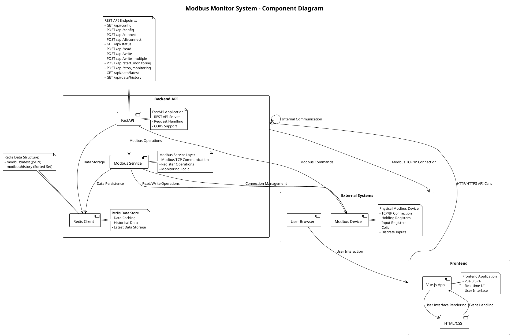

# Modbus Monitor UML Diagrams

## Component Diagram

### Component Description

#### Frontend Components
1. **Vue.js App** - Main single-page application built with Vue 3
   - Real-time data binding
   - User state management
   - API communication handling

2. **HTML/CSS** - User interface layer
   - Modern glass-morphism design
   - Responsive layout
   - Interactive components

#### Backend Components
1. **FastAPI** - REST API server
   - HTTP request handling
   - CORS middleware
   - API endpoint management
   - Data validation with Pydantic

2. **Modbus Service** - Modbus protocol layer
   - TCP client connection
   - Register read/write operations
   - Continuous monitoring
   - Error handling and retries

3. **Redis Client** - Data storage layer
   - Latest data caching
   - Historical data persistence
   - Fast data retrieval

#### External Systems
1. **Modbus Device** - Physical or simulated Modbus device
   - Supports Modbus TCP protocol
   - Multiple register types
   - Real-time data updates

2. **User Browser** - Client interface
   - Web application container
   - User interaction point

### Key Interfaces
- **API Interface**: RESTful JSON API between frontend and backend
- **Modbus Interface**: TCP-based protocol for device communication
- **Data Interface**: Redis pub/sub for data caching and retrieval
- **UI Interface**: User interaction through web browser

### Data Flow
1. User configures connection parameters via UI
2. Frontend sends API requests to backend
3. Backend establishes Modbus TCP connection
4. Modbus Service reads/writes register data
5. Data is stored in Redis for persistence
6. Frontend displays real-time data updates

@enduml